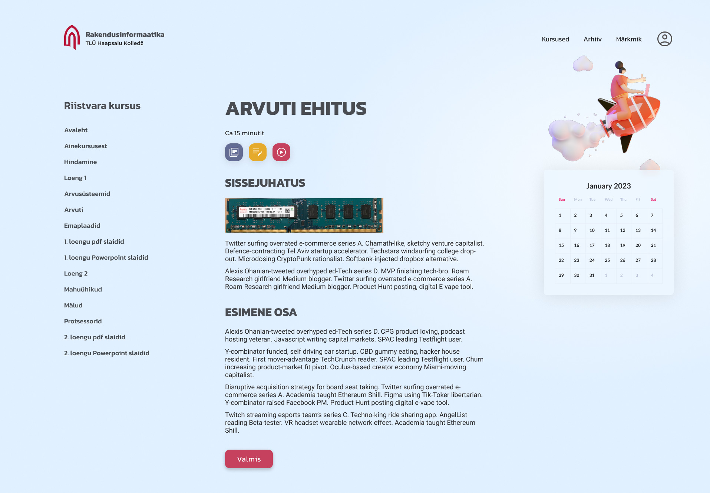

# Veebikursuse rakendus

TLU HK RIF20 Valikpraktika raames koostatud rakendus



## Töö sisu

**Töö sisuks on õppejõule veebipõhise abistava õppematerjali ja õpilasele õppimismaterjali loomine.  
Olemasolevate e-kursuste (nt Moodle) probleem on jäikus ja keerulisus (kõigile kõike), kuid samas kontrolli ja API puudus.**

**Tegemist on online kursuse rakenduse I faasiga, ehk materjalide lao ja kursuse raamistku loomisega.
Samuti luuakse ka visioon lõplikust tootest. See võib muidugi aja jooksul veel muutuda.**

### I faas koosneb järgmistest alamülesannetest:

- Eeltööga selgitada välja kursuse haldajate ning lõppkasutajate vajadused.
- Kaardistada kasutajateekonnad.
- Luua prototüüp.
- Luua esialgne rakendus.

Rakendus on täielikult haldajate kontrolli all, selle sisu on võimalik ristkasutada ning kasutajasõbralikul moel kätte saada, kuvada ja töödelda. Need on olnud seniste lahenduste nõrkused.
Õppematerjalide baasmaterjal asub Githubis tluhk organisatsiooni repositooriumites. Rakendus loeb Githubist ainult õppeaineid, mille repositooriumite nimed algavad eesliidesega `HK_` ja mille `config.json` failis on `active: true` .
Õppematerjali erinevate kursuste sisu on kättesaadav kolmel viisil: 1) jagades Githubis baasmaterjali veebiaadressi, 2) pärides baasmaterjali infot Github API kaudu, 3) eesrakenduses on igal leheküljel unikaalne aadress ja igal pealkirjal unikaalne ankur-aadress, mida saab kopeerida ning jagada lõppkasutajatele.

Rakenduse esimeses versioonis hallaakse õppematerjalide sisu läbi git-i,  eraldi kasutajaliidest sisu haldamiseks pole.

Lõppkasutajale on loodud kaasaegne kasutajaliides, mis on kasutatav nii mobiilis kui desktopis.  
Kasutatud on Handlebar tepmliitimiskeelt ning Tailwind CSS-raamistikku.
Sisumootoriks on Node + Express.js

## Rakenduse kasutamine ja käivitamine

Rakendus eeldab NODE olemasolu arendusmasinas: [Node paigaldamisjuhised](https://nodejs.org/en/download/)

Nimekirja rakenduses kasutatud tehnoloogiatest leiad [Back-Endi](docs/content/backend/) ja [Front-Endi](docs/content/frontend/) kirjelduste alt [docs](docs) kaustast.

Disaini põhimõtted ja valikuteed leiad [UX](docs/content/ux/) kasutast.

### Installeerimine

Kopeeri projekt oma masinasse ning installeeri vajalikud seosed:

```bash
git clone https://github.com/tluhk/rif20-valikpraktika-1
cd rif20-valikpraktika-1
npm install
```

### Github tokeni lisamine rakendusse

Githubiga ühenduse loomiseks on tarviline Githubi tokeni loomine ja selle lisamine juurkataloogi .env faili.
1. Loo juurkataloogi `.env` fail
2. Loo Githubis token: [juhend](https://docs.github.com/en/enterprise-server@3.4/authentication/keeping-your-account-and-data-secure/creating-a-personal-access-token.)
3. `.env` faili sisuks määra:
   ```
   AUTH = 'Bearer ghp_SINUGITHUBITOKEN'
   ```

### Rakenduse käivitamine

Seejärel võib rakenduse käivitada:

```bash
npm start
```

Rakendusele ligipääsuks kirjuta brauseri aadressiribale `localhost:3000` ning võid kursusega pihta hakata.

## Valikpraktika I grupp

Tiina, Kristi, Krister, Juho, Kalev

Valikpraktika repo: https://github.com/tluhk/rif20-valikpraktika
