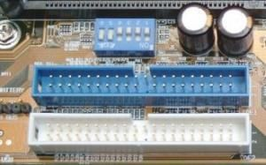
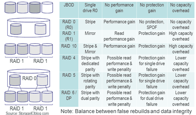

# Andmekandjad

## Andmekandjad

### Andmekandjad

Andmekandja on riistvaraline seade, millele on võimalik talletada digitaalset informatsiooni (dokumendid, pildid, videod jne) ja seda sealt hiljem lugeda.
Arvutite kontekstis võib jagada andmekandjad kaheks:
- sisemised andmekandjad
- välised andmekandjad

SATA liidesega 3,5" kõvaketas. Taimo Tammiku foto.

### Õpitüki läbinuna oskad:
- Selgitada andmekandjate funktsiooni
- Nimetada vähemalt 3 erinevat sisest andmekandja tüüpi
- Nimetada vähemalt 3 erinevat välist andmekandja tüüpi
- Nimetada andmekandjate olulisemaid parameetreid
- Analüüsida erinevate andmekandjate omadusi (mis on vahe, millised on ühe või teise
eelised)

## Andmekandjate olulisemad parameetrid

### Andmekandjaid iseloomustavad parameetrid

Tüüpiliselt saab andmekandjaid iseloomustada järgmiste parameetritega:

- **Füüsiline suurus**
    -  Sisemiste andmekandjate puhul (HDD ja ka osad SSD-d) suurus tollides (3.5", 2.5")
  - M.2. sisemiste SSD-de puhul suurus millimeetrites (laius ja pikkus kokku kirjutatult) nt 2280 - 22mm lai ja 80mm pikk
  - CD/DVD-d?
  - Diskettidel erinev suurus (enam praktiliselt ei kasutata)
- **Maht**
  - Tänapäeval tavaliselt gigabaitides (GB) või terabaitides (TB)
  - Diskettidel, CD-del megabaitides (MB)
- **Ühenduse tüüp**
  - PATA, SATA, PCIe, NVMe
  - Väliste puhul USB, USB-c jne
- **Andmeedastuskiirus**
  - Mb/s või Gb/s
  - Kõvaketaste puhul loetakse oluliseks parameetriks kõvaketta pöörlemise kiirus (5400rpm. 7200rpm, 10000rpm)
  - SSD-de puhul kirjutamise ja lugemise kiirus tihtipeale eraldi
- **Vahemälu** (cache)

## Sisemised andmekandjad

### Sisemised andmekandjad
Sisemised andmekandjad on andmekandjad, mis asuvad arvuti sees ja tavaliselt neid sealt välja ei võeta. Sisemiste andmekandjate eesmärk on tagada arvutile püsiv info talletusruum, muu hulgas operatsioonisüsteemi, programmide ja dokumentide jaoks.
Kõige levinumad sisemised andmekandjad on:
- HDD (Hard Disk Drive), ehk kõvaketas
- SSD (Solid State Drive), ehk välkmäluketas
Lisaks on olemas veel hübriidandmekandjad, milles on kokku pandud nii kõvaketas kui välkmäluketas.

### Valik sisemisi andmekandjaid:

[https://sisuloome.e-koolikott.ee/h5p/3100/embed](https://sisuloome.e-koolikott.ee/h5p/3100/embed)

### Kõvaketas (kõvakettaajam)
**Kõvaketas** on jäigast materjalist ketas, mis on kaetud magnetiseeruva materjali kihiga, mis omakorda annab võimaluse kõvakettale andmeid salvestada.

**Kõvakettaajam** on seade, mille sees on kõvakettad, neid ringi ajav mootor ja andmete salvestamiseks/lugemiseks mõeldud lugemispead koos elektroonikaga. Tavaliselt mõtleme kõvakettast rääkides just kõvakettaajamit, kuna kõvakettad on kõvakettaajami sisse monteeritud ja neid tavakasutaja vahetada ei saa.
Kõvakettaid on tavaliselt kahes suuruses:
- 3,5" (tolli) - mõeldud tavaliselt lauaarvutitele ja serveritele
- 2,5" - mõeldud pigem sülearvutitele
On ka teistsuguse suurusega kõvakettaid, kuid need ei ole väga levinud.

### Mis on kõvaketta sees?
- Lugemispead
- Plaadid
- Mootor
- Elektroonika
- Kõik eelnevalt loetud osad asuvad omakorda korpuse sees või küljes

[https://sisuloome.e-koolikott.ee/h5p/3099/embed](https://sisuloome.e-koolikott.ee/h5p/3099/embed)

### Kuidas andmeid kõvakettale salvestatakse?
- Magnetiseeritud / mitte magnetiseeritud
- Rajad
- Sektorid
- Silindrid
- Fragmentatsioon / defragmentimine (HDD/SSD)

### Välkmäluketas (SSD)
**SSD**, ehk *Solid State Drive* on mälukiipidest ehitatud andmekandja, millel ei ole liikuvaid osi. Kui traditsiooniline kõvaketas on olnud pikka aega arvuti arengus "piduriks", sest kõvaketta lugemiskiirust on raske suurendada tänu liikuvatele osadele, siis SSD-l seda probleemi enam ei ole. SSD kiirused on palju suuremad, kui kõvaketastel.

Veel mõni aeg tagasi olid välkmälukettad oluliselt kallimad, kui kõvakettad, kuid viimase paari aastaga on olukord selles suhtes palju muutunud. Praegusel hetkel on enamus uutest arvutitest varustatud juba just välkmäluseadmega. Kuigi välkmäluseadmed on hinna ja mahu poolest veel kõvaketastega võrreldes kallimad, ei ole vahe enam nii suur ja muud omadused (füüsiline suurus, kiirus, põrutuskindlus) kaaluvad hinnavahe juba üles.

### Kõvaketas vs SSD
Kumb on siis parem, kas HDD või SSD?
- Kindlasti on SSD kiirem, kuna sellel ei ole liikuvaid osi ja kiipidelt lugemine on kiirem, kui kõvaketta lugemispea liigutamine õigesse kohta ja sealt info lugemine.
- Liikuvate osade puudumise tõttu ei karda SSD põrutust. Kui kõvaketas peaks maha kukkua, siis suure tõenäosusega on kõvaketas peale seda rikutud.
- SSD-d on füüsiliselt väiksemad. See annab võimaluse teha väiksemaid arvuteid ja muid seadmeid.
- Kõvaketta eeliseks on hetkel veel odavam hind. Kuigi SSD-d on üsna kiiresti odavamaks läinud, siis suuremate mahtude puhul on HDD seni veel odavam. Samas muutuvad hinnad pidevalt ja juba praegu on enamus uusi arvuteid varustatud SSD-ga.
- SSD kirjutamiskordade arv on piiratud. Kuidas sellest üle saab.
- Kõvaketta fragmenteerumine - Kas SSD fragmenteerub?

## Sisemiste andmekandjate ühendused

Samamoodi, nagu on aegade jooksul arenenud andmekandjad, on arenenud ka ühendused,
mille kaudu on andmekandjad arvuti emaplaadi külge ühendatud. Kui andmekandjate maht ja
andmevahetuskiirus suurenevad, siis on vaja ka kiiremaid ühendusi.

### Sisemiste andmekandjate ühendused
| Tehnoloogia nimetus | Kiirus |
| --- | --- |
| ATA (Advanced Technology Attachment) | Kuni 133MB/s |
| SATA (Serial ATA | 150MB/s |
| SATA II | 300MB/s |
| SATA III | 600MB/s |
| NVME (Non-Volatile Memory Express) | 32GB/s |

| PATA | SATA | M.2. | SATA kaabel | PATA kaabel |
| --- | --- | --- | --- | --- |
|  |  |  |  |  |
| [Allikas](http://a51.idata.over-blog.com/0/16/29/65/carte_mre_port_ide.jpg) | [Allikas](https://upload.wikimedia.org/wikipedia/commons/4/4a/Asus_P8H61-MX_USB3_-_4_SATA3G_connectors-6521.jpg) | [Allikas](https://upload.wikimedia.org/wikipedia/commons/c/c2/M.2_connector_on_a_computer_motherboard.jpg) | Taimo Tammiku foto | Taimo Tammiku foto|

### RAID (Redundant Array Of Independent Disks)
RAID tähendab sõltumatute ketaste liiasmassiivi.
Salvestustehnoloogia, mis ühendab mitu ketast või kettasektsiooni üheks loogiliseks üksuseks

[Allikas](https://akit.cyber.ee/term/1037-raid)

[Allikas](https://live.staticflickr.com/7344/10629876605_e9f9061b34_b.jpg)

RAID erinevad konfiguratsioonid ja omadused:

[Allikas](https://storageio.com/images/SIO_RAIDCompare2.png)

## Välised andmekandjad

### Kuidas väliseid andmekandjaid loetakse?

Tänapäeval on USB välkmälud, välised kõvakettad ja kiire internet disketid, optilised kettad ja magnetlindid praktiliselt kasutusest välja tõrjunud. Siiski leidub hetkel veel piisavalt CD/DVD plaate ja vahel harva ka diskette, mida on vaja lugeda. Selleks on vaja eraldi seadet.

#### Valik väliseid seadmeid väliste andmekandjate lugemiseks

| 1,44" Floppy lugeja | Sisemine CD/DVD lugeja | Väline CD/DVD lugeja |
| --- | --- | --- |
|  |  |  |
| Taimo Tammiku foto | Taimo Tammiku foto | [Allikas](https://upload.wikimedia.org/wikipedia/commons/2/21/LG_Super_Multi_GSA-E40N-3432.jpg) |

#### Milline näeb üks CD/DVD-lugeja välja seestpoolt?

Taimo Tammiku foto

### Välised andmekandjad

Välised andmekandjad on andmekandjad, mis tavapäraselt ei asu arvuti sees ja mida on lihtne transportida. Väliseid andmekandjaid kasutataks andmete transportimiseks, säilitamiseks ja varukoopiate tegemiseks.

Välised andmekandjad on näiteks:
- Floppy disk
- Optilised andmekandjad (CD-ROM, DVD-ROM, Blu-ray, magnetoptiline ketas)
- Välkmälud
- Lindiseadmed
-  ...

### Valik väliseid andmekandjaid 

[https://sisuloome.e-koolikott.ee/h5p/3103/embed](https://sisuloome.e-koolikott.ee/h5p/3103/embed)

## Fragmenteerumine

Kui tühjale andmekandjale salvestada andmeid, siis võime ette kujutada, et andmeid salvestatakse sarnaselt, kui me kirjutame paberile sõnu. Kõik failid on kenasti salvestatud üksteise järel ja ühes tükis. Mis aga juhtub, kui me võtame olemasoleva faili, täiendame seda ja salvestame uuesti? Siis ei mahu see fail enam vanasse kohta, kuna fail on nüüd juba suurem. Samasugune oleks olukord, kui üritaksime pikemaks kirjutada juba paberile kirja pandud sõnu. Mida arvuti sellises olukorras teeb on see, et osa failist (nii palju kui mahub) jäetakse vanasse kohta ja see osa, mis vanasse kohta enam ei mahu, kirjutatakse kuhugi, kus on ruumi. Samas võib see vaba ruum olla näiteks kohas, mis on jäänud mõne faili kustutamisest ja kõik ei pruugi ka sinna ära mahtuda. Sellisel juhul kirjutatakse sellesse kohta taas nii palju kui mahub ja ülejäänud kuhugi mujale. Kui seda tegevust võrrelda nüüd paberile kirjutatud sõnadega, siis võime ette kujutada, et sellise kirjatüki lugemine läheks üsna keeruliseks. Küll on olemas meil selle kohta info või juhend, kuidas sõnad ja sõnade osad omavahel seotud ja ühenduses on (andmekandjatel on selle jaoks failisüsteem), kuid siiski võtab nende sõnade kokkupanemine ilmselgelt rohkem aega, kui nende lugemine siis kui need oleksid ühes tükis. Seda "jupitamise" protsessi nimetatakse fragmenteerumiseks. Selle tagajärjel muutub arvutil info lugemine andmekandjalt rohkem aeganõudvamaks ja seetõttu muutub ka arvuti töö aeglasemaks.

Selleks, et arvutil oleks "lihtsam" andmekandjalt andmeid lugeda, saab failid jälle üksteise järel "ritta" panna. Seda protsessi nimetatakse defragmentimiseks ja põhimõtteliselt teeb see seda, et korjab faili tükid kokku ja salvestab need nii, et fail on tervenisti ühes kohas.

Hästi illustreerib defragmenteerimise tulemust järgmine pilt:

  
[Allikas](https://img.devrant.com/devrant/rant/r_1903370_mo4VZ.jpg)
 
## Harjutused

### Harjutus 1

[https://sisuloome.e-koolikott.ee/h5p/3120/embed](https://sisuloome.e-koolikott.ee/h5p/3120/embed)

### Harjutus 2

[https://sisuloome.e-koolikott.ee/h5p/3121/embed](https://sisuloome.e-koolikott.ee/h5p/3121/embed)

### Harjutus 3

- Kui oluline on Sinu arvates arvuti puhul andmekandja suurus ja kiirus?
- Milliste nippidega saaks vältida andmete fragmenteerumist?

 *Litsenseeritud: [Creative Commons Attribution Share Alike License 4.0](http://creativecommons.org/licenses/by-sa/4.0/)*