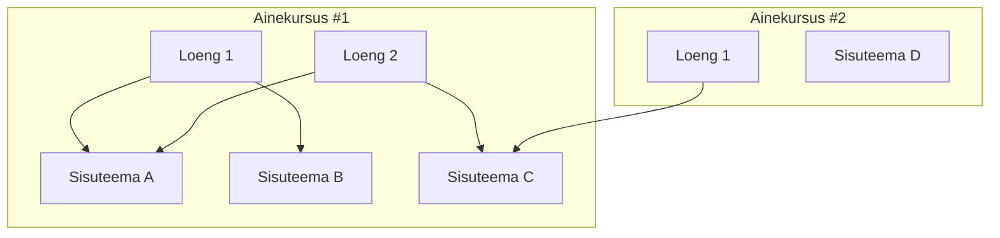

```mermaid
flowchart TB
    subgraph a2 ["Ainekursus #1"]
        l1[Loeng 1] --> c2[Sisuteema A]
        l1[Loeng 1] --> c3[Sisuteema B]
        l2[Loeng 2] --> c2[Sisuteema A]
        l2[Loeng 2] --> c4[Sisuteema C]
    end
    subgraph a3 [Ainekursus #2]
        l3[Loeng 1] --> c4[Sisuteema C]
        c5[Sisuteema D]
    end
```