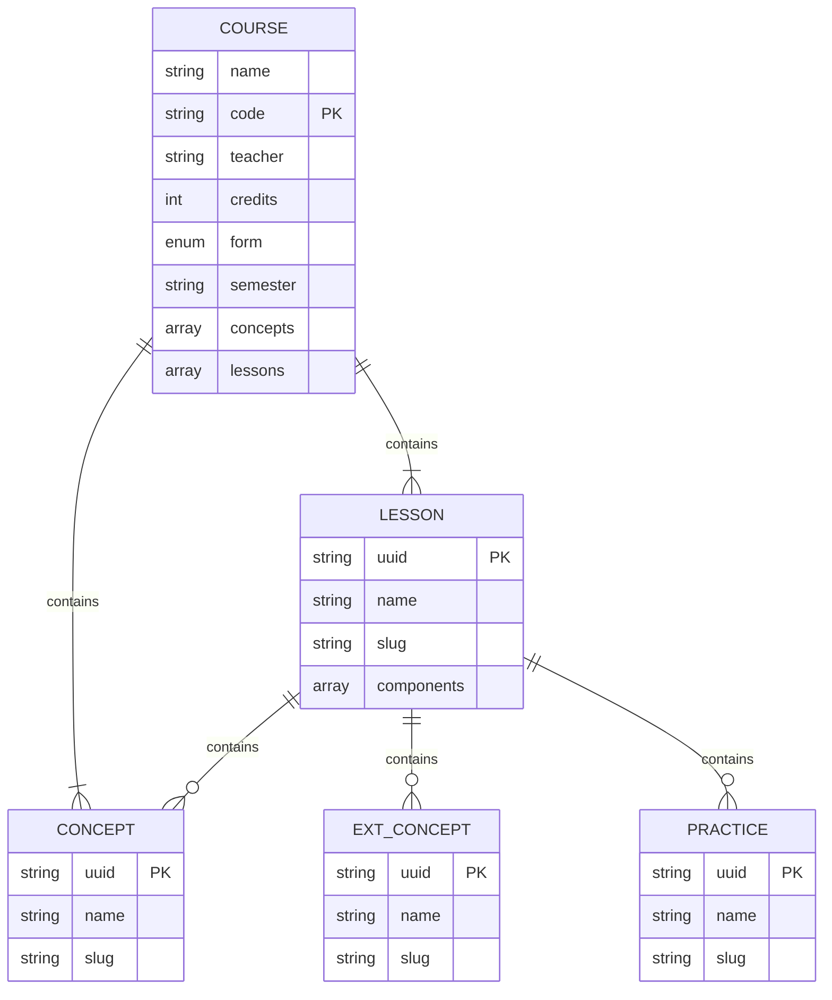

```mermaid
erDiagram
    COURSE ||--|{ LESSON: contains
    COURSE {
        string name
        string code PK
        string teacher
        int credits
        enum form
        string semester
        array concepts
        array lessons
    }
    COURSE ||--|{ CONCEPT: contains
    CONCEPT {
        string uuid PK
        string name
        string slug
    }
    EXT_CONCEPT {
        string uuid PK
        string name
        string slug
    }
    PRACTICE {
        string uuid PK
        string name
        string slug
    }
    LESSON ||--o{ CONCEPT: contains
    LESSON ||--o{ EXT_CONCEPT: contains
    LESSON ||--o{ PRACTICE: contains
    LESSON {
        string uuid PK
        string name
        string slug
        array components
    }

```
