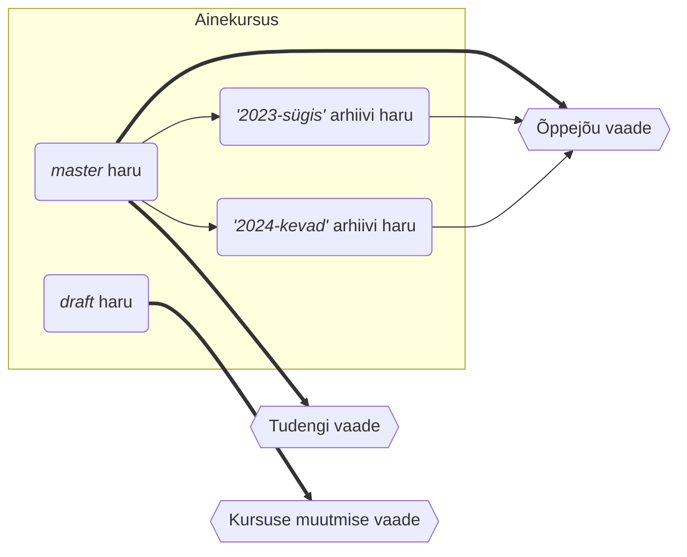

```mermaid
flowchart LR
    subgraph Ainekursus
        b1("`_master_ haru`")
        b3("`_'2023-sügis'_ arhiivi haru`")
        b4("`_'2024-kevad'_ arhiivi haru`")
        b2("`_draft_ haru`")
        b1 --> b3
        b1 --> b4
    end
    b1 ==> S{{Tudengi vaade}}
    b2 ==> E{{Kursuse muutmise vaade}}
    T{{Õppejõu vaade}}
    b1 ==> T
    b3 --> T
    b4 --> T
```