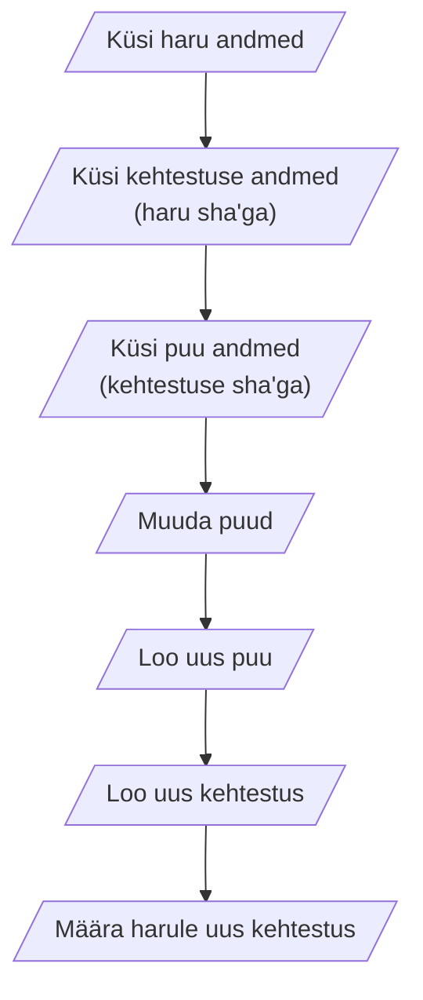

```mermaid
flowchart TD
    id0[/Küsi haru andmed/]
    id0 --> id1
    id1[/"`Küsi kehtestuse andmed
    (haru sha'ga)`"/]
    id2[/"`Küsi puu andmed
    (kehtestuse sha'ga)`"/]
    id1 --> id2
    id3[/"`Muuda puud`"/]
    id2 --> id3
    id4[/"`Loo uus puu`"/]
    id3 --> id4
    id5[/"`Loo uus kehtestus`"/]
    id4 --> id5
    id6[/"`Määra harule uus kehtestus`"/]
    id5 --> id6
```
