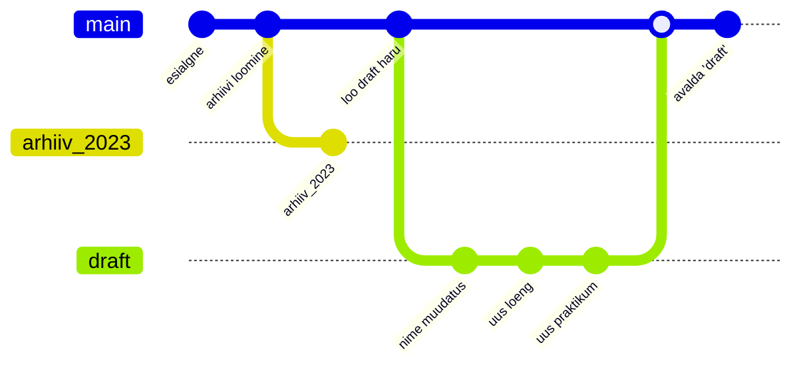

```mermaid

gitGraph
    commit id: "esialgne"
    commit id: "arhiivi loomine"
    branch arhiiv_2023
    checkout arhiiv_2023
    commit id: "arhiiv_2023"
    checkout main
    commit id: "loo draft haru"
    branch draft
    checkout draft
    commit id: "nime muudatus"
    commit id: "uus loeng"
    commit id: "uus praktikum"
    checkout main
    merge draft
    commit id: "avalda 'draft'"
```