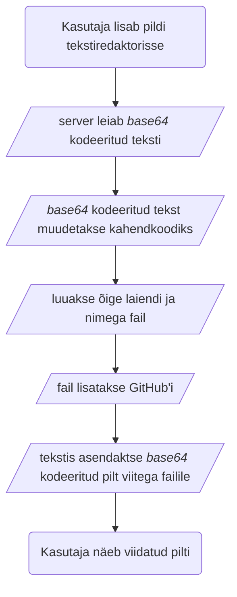

```mermaid
flowchart TD
    id0(Kasutaja lisab pildi tekstiredaktorisse)
    id0 --> id1
    id1[/"`server leiab _base64_ kodeeritud teksti`"/]
    id2[/"`_base64_ kodeeritud tekst muudetakse kahendkoodiks`"/]
    id1 --> id2
    id3[/"`luuakse õige laiendi ja nimega fail`"/]
    id2 --> id3
    id4[/"`fail lisatakse GitHub'i`"/]
    id3 --> id4
    id5[/"`tekstis asendaktse _base64_ kodeeritud pilt viitega failile`"/]
    id4 --> id5
    id6("`Kasutaja näeb viidatud pilti`")
    id5 --> id6
```
